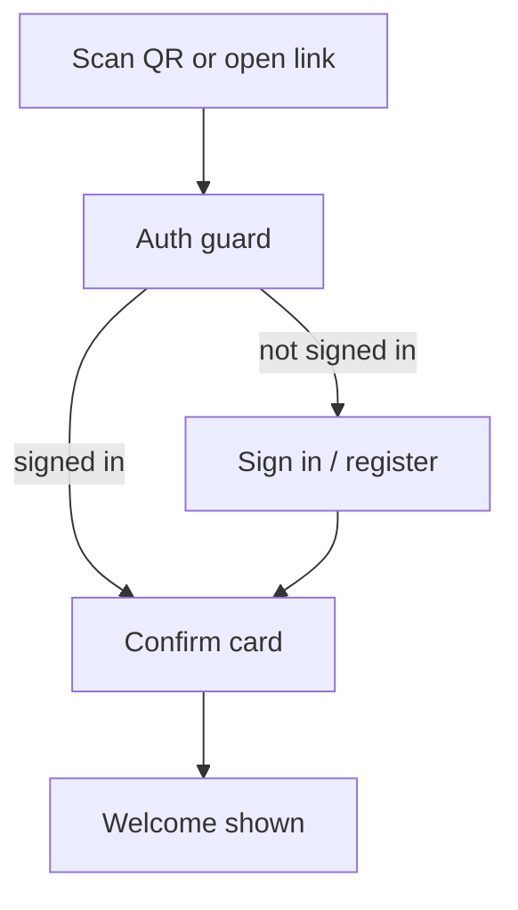

# Check in

This is the next-stage page for authenticated attendees to confirm that they came to a
published meeting.

Check-in must not create anonymous or dropped-identifier users. The attendee signs in
first via the active provider: web login/register on web, and WeChat identity in the
mini program. Only after auth resolves a `user.id` does the check-in page load.

The page is mobile-centric because the main scenario is scanning a meeting QR code from
the WeChat mini program. Detailed WeChat provider behavior is left for the next stage;
this design only assumes that it resolves to the shared auth contract.

## Interactive question cards

Check-in is a small, friendly **card flow** — one question at a time — rather than a
single dense form. Auth happens before this flow, so the check-in cards never ask for a
name just to identify the attendee.



### Confirm card

```
┌─────────────────────────────────────┐
│  MISU · Meeting #142                 │
│  Sat Jul 12 · Embrace Change         │
├─────────────────────────────────────┤
│  Welcome! You're our                 │
│  Timer, Grammarian today, thank you! │
└─────────────────────────────────────┘
```

### Card details

- **Header**: the meeting being checked into (number · date · theme).
- **Welcome message**: greets the attendee and summarizes the roles they booked for this
  meeting (if any). If they have no booked role, it says `Welcome to today's meeting!`.
  No role selection is shown on this page, and there is no separate checkmark/"Checked in"
  heading.
- **Automatic confirmation**: opening the page confirms attendance immediately. Until the
  backend check-in API lands, the mini program stores the confirmation locally and shows a
  friendly success state; the UI shape is final, the persistence is staged.

## Mini Program Page (`/pages/checkin/checkin`)

Entry points:
- Meeting tab's **Check in** action opens the active/upcoming meeting's check-in page.
- A future QR code can deep-link to `/pages/checkin/checkin?meetingId=<id>`.

Page states:

1. **Loading** — wait for WeChat auth session and load `GET /api/meetings/:meeting_id`.
2. **Confirmed** — store attendance locally and show a success state with a welcome line
  based on the user's booked roles. If the user has no booked role, welcome them as an
  attendee.

First-stage implementation note: use local storage key `checkin:<meeting_id>:<user_id>` to
remember confirmation on this device. Backend persistence will replace this with
`POST /api/checkin` later without changing the page's interaction model.

## Schema mapping

- **Identity** → the authenticated `user.id` from `current_identity()`. Check-in does
  not write names or create anonymous users.
- **Booked roles** → role slots where `booker_id = me`, used only to customize the welcome
  message. Role selection/actual-taker correction is not part of this simple check-in page.
- **Check-in record** → next-stage storage should record attendance separately from
  role booking so no-role attendees are represented.
- **Admin-editable**: admins can adjust attendance and actual role-taking records
  afterward — for attendees who missed check-in or picked the wrong role.

## Next-stage WeChat notes

- Define how the mini program obtains and refreshes WeChat identity.
- Decide when to ask for or edit `display_name` if the WeChat profile is incomplete.
- Preserve the return target so scanning a meeting QR code signs the user in and then
  returns directly to that meeting's check-in page.
