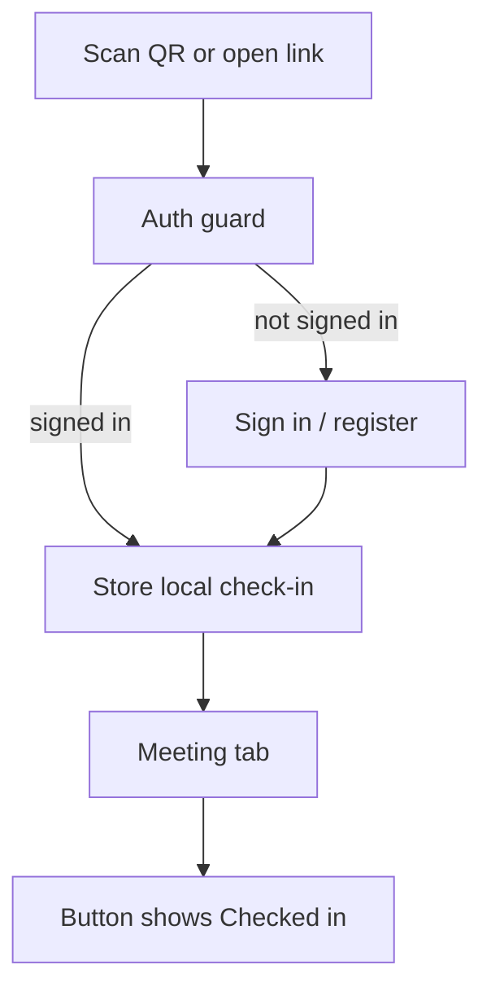

# Check in

This is the next-stage page for authenticated attendees to confirm that they came to a
published meeting.

Check-in must not create anonymous or dropped-identifier users. The attendee signs in
first via the active provider: web login/register on web, and WeChat identity in the
mini program. Only after auth resolves a `user.id` does the check-in page load.

The page is mobile-centric because the main scenario is scanning a meeting QR code from
the WeChat mini program. Detailed WeChat provider behavior is left for the next stage;
this design only assumes that it resolves to the shared auth contract.

## Interaction model

Check-in is not a separate form. It is a one-tap status on the Meeting tab, and QR code
scan/deep-link entry automatically records the same status before showing the Meeting tab.
Auth happens before this flow, so check-in never asks for a name just to identify the
attendee.



### Meeting tab status

```
┌─────────────────────────────────────┐
│  MISU · Meeting #142                 │
│  Sat Jul 12 · Embrace Change         │
├─────────────────────────────────────┤
│  [ Checked in ]  [ Vote ] [ Timer ]  │
└─────────────────────────────────────┘
```

### Details

- **Meeting tab button**: starts as **Check in**. Tapping it records local attendance and
  changes it to green **Checked in**.
- **QR/deep-link entry**: `/pages/checkin/checkin?meetingId=<id>` records local attendance
  immediately, remembers the target meeting id, then switches to the Meeting tab. The
  Meeting tab opens that meeting and shows **Checked in**.
- **No role selection**: booked roles are not selected or corrected here. Role information
  may personalize future copy, but the first-stage UI only confirms that the user came.
- **Persistence**: until the backend check-in API lands, the mini program stores the
  confirmation locally; the UI shape is final, backend persistence is staged.

## Mini Program Pages

Entry points:
- Meeting tab's **Check in** action records attendance in place.
- A future QR code can deep-link to `/pages/checkin/checkin?meetingId=<id>`; that page is
  a silent redirector to the Meeting tab after recording attendance.

Page states:

1. **Meeting tab loading** — wait for WeChat auth session and load the active/upcoming
   meeting.
2. **Not checked in** — show **Check in**.
3. **Checked in** — show green **Checked in**.

First-stage implementation note: use local storage key `checkin:<meeting_id>:<user_id>` to
remember confirmation on this device. Backend persistence will replace this with
`POST /api/checkin` later without changing the page's interaction model.

## Schema mapping

- **Identity** → the authenticated `user.id` from `current_identity()`. Check-in does
  not write names or create anonymous users.
- **Booked roles** → not edited by this flow. Role selection/actual-taker correction is not
  part of this simple check-in status.
- **Check-in record** → next-stage storage should record attendance separately from
  role booking so no-role attendees are represented.
- **Admin-editable**: admins can adjust attendance and actual role-taking records
  afterward — for attendees who missed check-in or picked the wrong role.

## Next-stage WeChat notes

- Define how the mini program obtains and refreshes WeChat identity.
- Decide when to ask for or edit `display_name` if the WeChat profile is incomplete.
- Preserve the return target so scanning a meeting QR code signs the user in and then
  returns directly to that meeting's check-in page.
