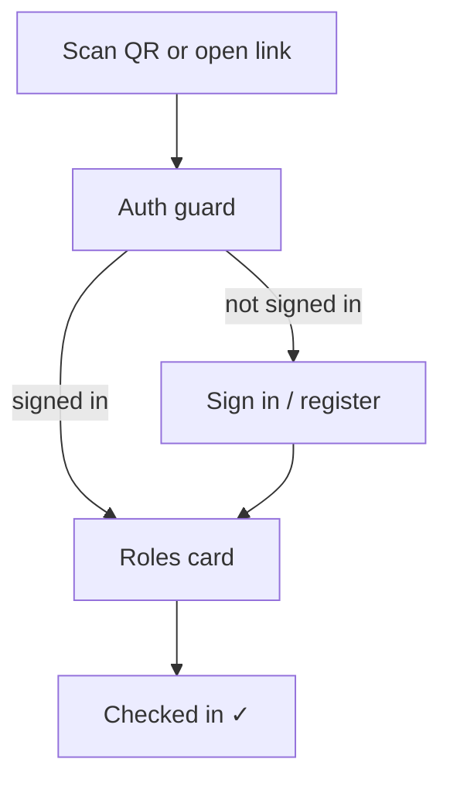

# Check in

This is the page for authenticated attendees to check in for a published meeting.

Check-in must not create anonymous or dropped-identifier users. The attendee signs in
first via the active provider: web login/register on web, and WeChat identity in the
mini program. Only after auth resolves a `user.id` does the check-in page load.

The page is mobile-centric because the main scenario is scanning a meeting QR code from
the WeChat mini program. Detailed WeChat provider behavior is left for the next stage;
this design only assumes that it resolves to the shared auth contract.

## Interactive question cards

Check-in is a small, friendly **card flow** — one question at a time — rather than a
single dense form. Auth happens before this flow, so the check-in cards never ask for a
name just to identify the attendee.



### Roles card

```
┌─────────────────────────────────────┐
│  MISU · Meeting #142                 │
│  Sat Jul 12 · Embrace Change         │
├─────────────────────────────────────┤
│  Welcome, <name>!                    │
├─────────────────────────────────────┤
│  Which roles do you take today?      │
│  [ timer ] [ grammarian ] [ TOE ]    │
│  [ No role today ]                   │
│  ─────────────────────────────────── │
│  [ Check In ]                        │
└─────────────────────────────────────┘
```

### Card details

- **Header**: the meeting being checked into (number · date · theme).
- **Roles card**: tappable role chips for the roles the attendee took today. A user's own
  booked roles for this meeting are pre-selected; they can tap others they picked up.
- **No role today**: a quick choice for authenticated attendees who took no role.
- **Check In**: commits the check-in and any selected roles.

## Schema mapping

- **Identity** → the authenticated `user.id` from `current_identity()`. Check-in does
  not write names or create anonymous users.
- **Selected roles** → `role_slot`s for this meeting. The attendee's own booked roles
  (`booker_id = me`) are pre-selected; confirming one sets `taker_id = me`, tapping an
  open/other one claims it as the actual taker (`taker_id = me`). `booker_id` is never
  overwritten, so plan-vs-reality is preserved.
- **Check-in record** → a new `check_in` table `(meeting_id, user_id, checked_in_at)` is
  needed; it was scoped out of the initial schema and will be added when this is locked.
- **Admin-editable**: admins can adjust attendance and actual role takers (`taker_id`)
  afterward — for attendees who missed check-in or picked the wrong role.

## Next-stage WeChat notes

- Define how the mini program obtains and refreshes WeChat identity.
- Decide when to ask for or edit `display_name` if the WeChat profile is incomplete.
- Preserve the return target so scanning a meeting QR code signs the user in and then
  returns directly to that meeting's check-in page.
