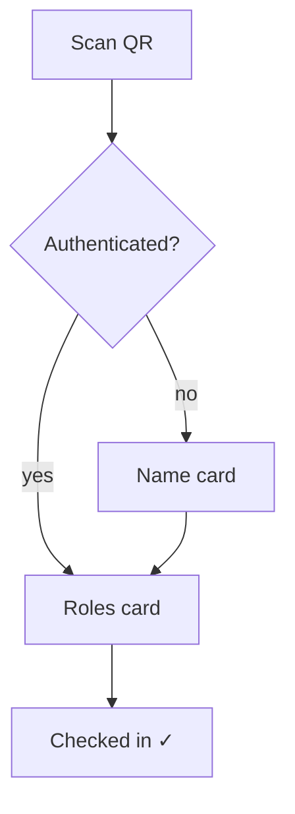

# Check in

This is the page for attendees to check in:

- If user has been authenticated (via cookies or wechat identity), show the check in page.
- If user hasn't been authenticated:
  - Drop an identifier.
  - Show the check in page.

The page is mobile centric as most attendees use phones to check in.

## Interactive question cards

Check-in is a small, friendly **card flow** — one question at a time — rather than a
single dense form. The card advances until the attendee checks in.



### Authenticated user — go straight to the roles card

```
┌─────────────────────────────────────┐
│  MISU · Meeting #142                 │
│  Sat Jul 12 · Embrace Change         │
├─────────────────────────────────────┤
│  Welcome, <name>!                    │
├─────────────────────────────────────┤
│  Which roles do you take today?      │
│  [ timer ] [ grammarian ] [ TOE ]    │
│  [ I'm a guest ]                     │
│  ─────────────────────────────────── │
│  [ Check In ]                        │
└─────────────────────────────────────┘
```

### Non-authenticated user — ask the name first

```
┌─────────────────────────────────────┐
│  MISU · Meeting #142                 │
│  Sat Jul 12 · Embrace Change         │
├─────────────────────────────────────┤
│  Welcome,                            │
│    May I have your name?             │
│  [ Input Box ]                       │
└─────────────────────────────────────┘
```

…then the same roles card:

```
┌─────────────────────────────────────┐
│  MISU · Meeting #142                 │
│  Sat Jul 12 · Embrace Change         │
├─────────────────────────────────────┤
│  Welcome, <name>!                    │
├─────────────────────────────────────┤
│  Which roles do you take today?      │
│  [ timer ] [ grammarian ] [ TOE ]    │
│  [ I'm a guest ]                     │
│  ─────────────────────────────────── │
│  [ Check In ]                        │
└─────────────────────────────────────┘
```

### Card details

- **Header**: the meeting being checked into (number · date · theme).
- **Name card** (unauthenticated only): a single input; on submit the name is saved and
  the flow advances to the roles card.
- **Roles card**: tappable role chips for the roles the attendee took today. A user's own
  booked roles for this meeting are pre-selected; they can tap others they picked up.
- **"I'm a guest"**: a quick choice for attendees who took no role.
- **Check In**: commits the check-in and any selected roles.

## Schema mapping

- **Identity** → a `user` row (existing, or a fresh guest created from the dropped
  identifier). The name card writes `user.display_name`.
- **Selected roles** → `role_slot`s for this meeting. The attendee's own booked roles
  (`booker_id = me`) are pre-selected; confirming one sets `taker_id = me`, tapping an
  open/other one claims it as the actual taker (`taker_id = me`). `booker_id` is never
  overwritten, so plan-vs-reality is preserved.
- **Check-in record** → a new `check_in` table `(meeting_id, user_id, checked_in_at)` is
  needed; it was scoped out of the initial schema and will be added when this is locked.
- **Admin-editable**: admins can adjust attendance and actual role takers (`taker_id`)
  afterward — for attendees who missed check-in or picked the wrong role.