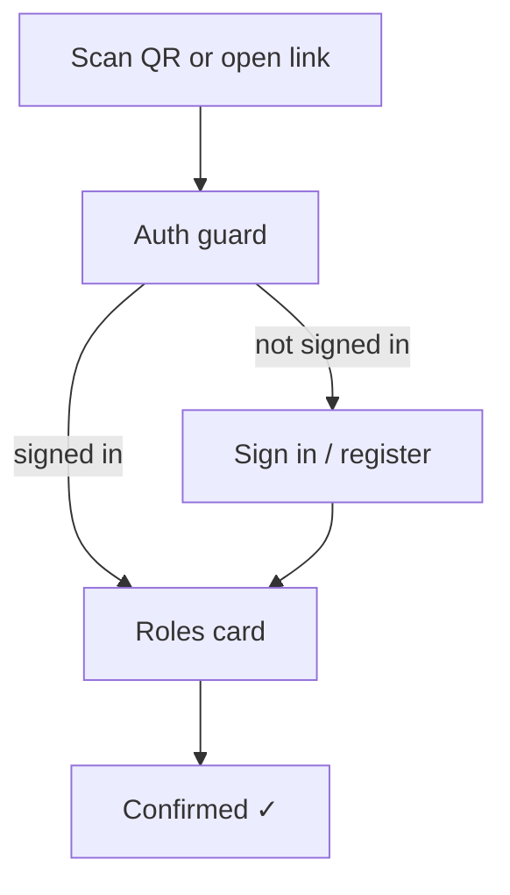

# Check in

This is the next-stage page for authenticated attendees to confirm attendance and the
roles they actually took in a published meeting.

Check-in must not create anonymous or dropped-identifier users. The attendee signs in
first via the active provider: web login/register on web, and WeChat identity in the
mini program. Only after auth resolves a `user.id` does the check-in page load.

The page is mobile-centric because the main scenario is scanning a meeting QR code from
the WeChat mini program. Detailed WeChat provider behavior is left for the next stage;
this design only assumes that it resolves to the shared auth contract.

## Interactive question cards

Check-in is a small, friendly **card flow** — one question at a time — rather than a
single dense form. Auth happens before this flow, so the check-in cards never ask for a
name just to identify the attendee.



### Roles card

```
┌─────────────────────────────────────┐
│  MISU · Meeting #142                 │
│  Sat Jul 12 · Embrace Change         │
├─────────────────────────────────────┤
│  Welcome, <name>!                    │
├─────────────────────────────────────┤
│  Which roles do you take today?      │
│  [ timer ] [ grammarian ] [ TOE ]    │
│  [ No role today ]                   │
│  ─────────────────────────────────── │
│  [ Check In ]                        │
└─────────────────────────────────────┘
```

### Card details

- **Header**: the meeting being checked into (number · date · theme).
- **Roles card**: tappable role chips for the roles the attendee took today. A user's own
  booked roles for this meeting are pre-selected; they can tap others they picked up.
- **No role today**: a quick choice for authenticated attendees who took no role. In the
  first stage this creates no persistent attendance record.
- **Check In**: confirms attendance and any selected actual role-taking records. Until the
  backend check-in API lands, the mini program stores the confirmation locally and shows a
  friendly success state; the UI shape is final, the persistence is staged.

## Mini Program Page (`/pages/checkin/checkin`)

Entry points:
- Meeting tab's **Check in** action opens the active/upcoming meeting's check-in page.
- A future QR code can deep-link to `/pages/checkin/checkin?meetingId=<id>`.

Page states:

1. **Loading** — wait for WeChat auth session and load `GET /api/meetings/:meeting_id`.
2. **Role selection** — show meeting title and chips for all role slots:
   - User's booked roles (`booker_id = me`) are pre-selected.
   - Taken-by-others roles are still selectable, because check-in is about actual role taking
     and substitutions.
   - Meeting-wide slots (Timer, Grammarian, etc.) appear alongside session-linked slots.
3. **No role today** — clears selected roles and allows a no-role check-in.
4. **Confirmed** — show selected roles (or "No role today") and a return-to-meeting action.

First-stage implementation note: use local storage key `checkin:<meeting_id>:<user_id>` to
remember confirmation on this device. Backend persistence will replace this with
`POST /api/checkin` later without changing the page's interaction model.

## Schema mapping

- **Identity** → the authenticated `user.id` from `current_identity()`. Check-in does
  not write names or create anonymous users.
- **Selected roles** → role slots for this meeting. The attendee's own booked roles
  (`booker_id = me`) are pre-selected; confirming check-in should write actual
  role-taking records in the next-stage schema without overwriting `booker_id`.
- **Check-in record** → next-stage storage should record attendance separately from
  role booking so no-role attendees are represented.
- **Admin-editable**: admins can adjust attendance and actual role-taking records
  afterward — for attendees who missed check-in or picked the wrong role.

## Next-stage WeChat notes

- Define how the mini program obtains and refreshes WeChat identity.
- Decide when to ask for or edit `display_name` if the WeChat profile is incomplete.
- Preserve the return target so scanning a meeting QR code signs the user in and then
  returns directly to that meeting's check-in page.
