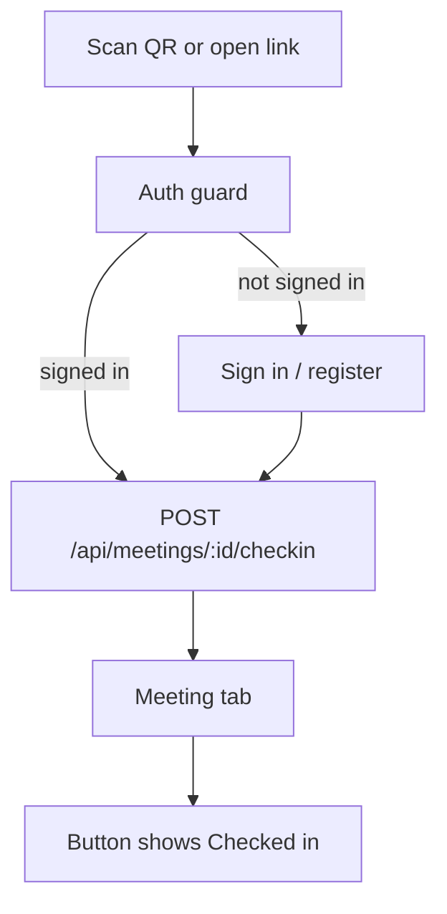

# Check in

This is the page for authenticated attendees to confirm they came to a published meeting.
Check-in has three purposes:

1. **Track attendance** — a durable record of who came to each meeting.
2. **Link attendees to raw user records** — users are often raw `{id, display_name}` rows
   admins typed in (as role assignees). Check-in makes real, WeChat-authenticated
   people linkable to those raw records.
3. **Feed the voting page** — provide the pool of attendees and resolved role takers.

Check-in must not create anonymous or dropped-identifier users. The attendee signs in
first via the active provider: web login/register on web, and WeChat identity in the
mini program. Only after auth resolves a `user.id` does the check-in page load.

The page is mobile-centric because the main scenario is scanning a meeting QR code from
the WeChat mini program. Detailed WeChat provider behavior is left for the next stage;
this design only assumes that it resolves to the shared auth contract.

## Design decision: presence-only check-in, admin-driven linking

Check-in stays a **one-tap presence** action. Attendees do **not** self-select a role or a
raw identity at check-in — that removes the riskiest interaction (a person picking the
wrong identity) and keeps the mini program simple.

Identity **linking** (purpose #2) is an **admin action**: an admin links a free raw user
record to a WeChat identity that was present in the meeting, or ignores the raw record.
Raw users keep working exactly as before for agenda and voting, because they already are
the `role_assignment.taker_id`. Voting keeps reading those regardless of
whether linking happened.

If self-service claiming is wanted later, it can be layered on top without changing this
data model (a claim would trigger the same merge operation an admin link performs).

## Interaction model

Check-in is not a separate form. It is a one-tap status on the Meeting tab, and QR code
scan/deep-link entry automatically records the same status before showing the Meeting tab.
Auth happens before this flow, so check-in never asks for a name just to identify the
attendee.


```mermaid
flowchart TD
    Q[Scan QR or open link] --> A[Auth guard]
    A -->|signed in| C[POST /api/meetings/:id/checkin]
    A -->|not signed in| S[Sign in / register]
    S --> C
    C --> M[Meeting tab]
    M --> DONE[Button shows Checked in]
```

### Meeting tab status

```
┌─────────────────────────────────────┐
│  MISU · Meeting #142                 │
│  Sat Jul 12 · Embrace Change         │
├─────────────────────────────────────┤
│  [ Checked in ]  [ Vote ] [ Timer ]  │
└─────────────────────────────────────┘
```

### Details

- **Meeting tab button**: starts as **Check in**. Tapping it calls the check-in API,
  records attendance for the current `user.id`, and turns green **Checked in**.
- **QR/deep-link entry**: `/pages/checkin/checkin?meetingId=<id>` calls the same API
  immediately, remembers the target meeting id, then switches to the Meeting tab. The
  Meeting tab opens that meeting and shows **Checked in**.
- **No role selection**: booked roles are not selected or corrected here. Role linking is
  an admin action (see below), not part of check-in.
- **Display name**: check-in may confirm/edit the signed-in user's `display_name`; the
  edit is saved on that user. It is not a way to pick a *different* identity.
- **Persistence**: attendance is stored server-side via `POST /api/meetings/:id/checkin`.
  Local storage becomes only an optimistic cache of the button state.

## Mini Program Pages

Entry points:
- Meeting tab's **Check in** action records attendance in place.
- A QR code can deep-link to `/pages/checkin/checkin?meetingId=<id>`; that page is a
  silent redirector to the Meeting tab after recording attendance.

Page states:

1. **Meeting tab loading** — wait for WeChat auth session and load the active/upcoming
   meeting.
2. **Not checked in** — show **Check in**.
3. **Checked in** — show green **Checked in**.

## API

```
GET  /api/meetings/:id/checkin
  -> { checked_in: bool, checked_in_at: datetime|null, display_name: string }

POST /api/meetings/:id/checkin
  body: { display_name?: string }        // optional confirm/edit of the caller's name
  -> { checked_in: true, checked_in_at }
```

- Both require an authenticated `user.id` (bearer or cookie via the shared auth guard).
- `POST` upserts one `attendance` row per `(meeting_id, user_id)` with `source = 'self'`.
  It is idempotent: checking in again just refreshes `checked_in_at` and, if provided,
  `display_name`.
- No `role_slot_id` is involved. Attendance never touches `role_assignment`.

### Admin linking API

```
POST /api/admin/meetings/:id/link
  body: { raw_user_id: number, wechat_user_id: number }
  -> { merged_user_id, ok: true } | 409 conflict

POST /api/admin/meetings/:id/unlink
  body: { user_id: number }
  -> moves the wechat_identity + session to a fresh empty user, freeing the raw record
```

`link` connects a **free** raw user (no `wechat_identity`) to a WeChat identity present in
the meeting (has an `attendance` row), performing the merge operation below.

## Merge operation (admin link)

Links WeChat row `U` onto free raw user `T` by repointing every reference, then removing
the emptied shell:

1. **Guard**: if `T` already has a `wechat_identity` (a different person), **abort** with a
   conflict — never overwrite an existing linked identity.
2. `wechat_identity`: point `U`'s openid at `T`.
3. `auth_session`: repoint `U -> T` (the session stays valid, now resolving to `T`).
4. `role_assignment` (`taker_id`) and `attendance`: repoint `U -> T`.
5. `T.display_name`: keep or update to the confirmed name.
6. Delete `U` **only if provably empty** (no identity, session, assignment or attendance
   references remain).

Unlink is the inverse: detach the `wechat_identity` (and its live session) onto a new
empty user so the person keeps a login, and the raw record becomes free again.

## Schema mapping

- **Identity** → the authenticated `user.id` from `current_identity()`. Check-in does
  not write names for other people or create anonymous users.
- **Attendance** → one `attendance` row per person per meeting (see
  `../storage/schema.md`). No-role attendees are represented naturally.
- **Booked/taken roles** → unchanged `role_assignment` rows. Linking makes a raw
  assignee resolve to a real logged-in user; without linking they stay raw.
- **Admin-editable**: admins adjust attendance and identity links afterward — via the
  **Attendance & linking** panel on the meeting editor. All admin-created or admin-edited
  attendance rows use `source = 'admin'`.

## Voting hook

No new work for voting here. The voting page reads `role_assignment.taker_id` for
role-taker candidates and `attendance` for the general attendee pool. This design
guarantees those users are real and de-duplicated once an admin has linked identities.

## Next-stage WeChat notes

- Define how the mini program obtains and refreshes WeChat identity.
- Decide when to ask for or edit `display_name` if the WeChat profile is incomplete.
- Preserve the return target so scanning a meeting QR code signs the user in and then
  returns directly to that meeting's check-in page.
