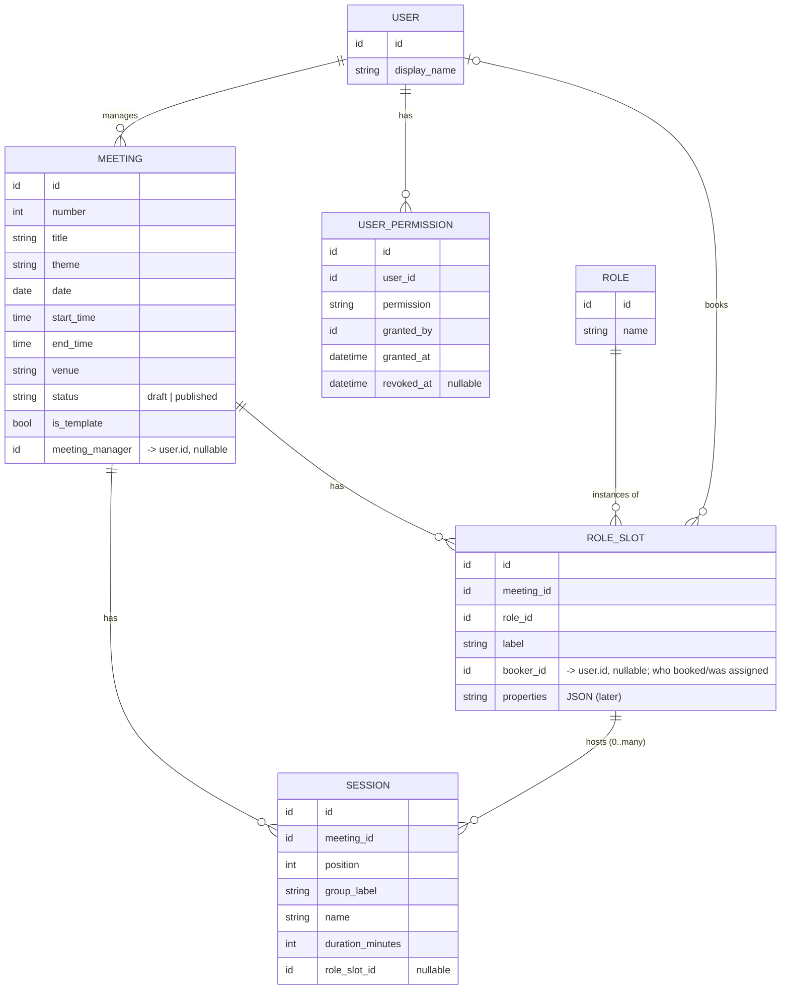

# Storage schema

We use sqlite to save the data.

Normalized tables are the source of truth; a meeting can still be served as one nested
JSON document via a view when needed.

Scope: covers the designed pages — meeting info & sessions (`meeting_info.md`) and role
booking (`role_registration.md`) — plus the shared user model. Voting, timer and poster
storage are deferred until those pages are designed.

## Entity overview

## `user`

A person the system knows about. Deliberately thin; admin credentials and future WeChat
identity attach to a user but stay out of this table for now.

| Column         | Type    | Notes            |
| -------------- | ------- | ---------------- |
| `id`           | id (PK) |                  |
| `display_name` | string  | name or nickname |

Membership (member vs. guest) is intentionally omitted for now — it is a time-sensitive
relationship. See `todo.md`.

## `user_permission`

Explicit global permission grants. Authentication resolves `user.id`; this table is used
by authorization checks for management actions.

| Column       | Type              | Notes                                |
| ------------ | ----------------- | ------------------------------------ |
| `id`         | id (PK)           |                                      |
| `user_id`    | id (FK)           | -> `user.id`                         |
| `permission` | string            | e.g. `site_admin`                    |
| `granted_by` | id (FK)           | -> `user.id`                         |
| `granted_at` | datetime          | audit trail                          |
| `revoked_at` | datetime nullable | null means the grant is still active |

Meeting-scoped management uses `meeting.meeting_manager` rather than this table.

## `meeting`

The core entity. Sessions, role slots, agenda, timer, voting and check-in all hang off it.

| Column            | Type    | Notes                                                           |
| ----------------- | ------- | --------------------------------------------------------------- |
| `id`              | id (PK) |                                                                 |
| `number`          | int     | meeting number (derived from last + 1)                          |
| `title`           | string  |                                                                 |
| `theme`           | string  |                                                                 |
| `date`            | date    |                                                                 |
| `start_time`      | time    | meeting start; session start times derive from it               |
| `end_time`        | time    |                                                                 |
| `venue`           | string  |                                                                 |
| `status`          | string  | `draft` \| `published`                                          |
| `is_template`     | bool    | a meeting flagged as a reusable template                        |
| `meeting_manager` | id (FK) | -> `user.id`; **nullable** (templates / fresh drafts have none) |

Notes:
- **Inter-session buffer** is a constant (`BUFFER_MINUTES = 1`), not a column — nothing
  edits it in the current design. It is added after each session when computing the next
  session's start time.
- **Session start times** are computed (`start_time` + cumulative durations + buffer),
  never stored.

## `session`

An ordered row in a meeting's agenda: what happens, for how long, and which role slot
hosts it.

| Column             | Type    | Notes                            |
| ------------------ | ------- | -------------------------------- |
| `id`               | id (PK) |                                  |
| `meeting_id`       | id (FK) | -> `meeting.id`                  |
| `position`         | int     | order within the meeting         |
| `group_label`      | string  | visual grouping for the printed agenda |
| `name`             | string  | session name                     |
| `duration_minutes` | int     |                                  |
| `role_slot_id`     | id (FK) | -> `role_slot.id`; **nullable**  |

A session references at most one role slot (one role per session for now). Many sessions
may point to the **same** role slot, so one role can host multiple sessions (e.g. the
Toastmaster hosting several sessions).

## `role`

The managed catalog of role definitions (distinct from a per-meeting assignment). Grown
via the creatable combobox on the sessions grid. Role properties (member-only, needs
extra info) are deferred as next improvements.

| Column | Type    | Notes |
| ------ | ------- | ----- |
| `id`   | id (PK) |       |
| `name` | string  |       |

## `role_slot`

A role needed in a specific meeting — the pivot every first-stage feature reads and
writes. `booker_id` is who booked or was assigned in advance. Actual role-taking and
attendance are deferred to the next-stage check-in design.

| Column       | Type    | Notes                                                        |
| ------------ | ------- | ------------------------------------------------------------ |
| `id`         | id (PK) |                                                              |
| `meeting_id` | id (FK) | -> `meeting.id`                                              |
| `role_id`    | id (FK) | -> `role.id`                                                |
| `label`      | string  | e.g. `Speaker 1`                                            |
| `booker_id`  | id (FK) | -> `user.id`; **nullable** (null = not booked); set by role booking / admin assignment |
| `properties` | string  | JSON for role-specific extra info (deferred): speech title/level, evaluatee, etc. |

- **Session-linked slot**: one or more sessions have `role_slot_id` pointing to it.
- **Meeting-wide slot**: no session points to it (Timer, Ah-Counter, Grammarian,
  General Evaluator).
- **Which one downstream reads**: first-stage artifacts (agenda, printed pager, role
  booking cards) use `booker_id`.
- **Next stage**: check-in will introduce attendance / actual role-taking records for
  no-shows, substitutions, walk-ins and no-role attendees.

## Serving a meeting as JSON (optional)

The normalized tables can be merged into one nested JSON document per meeting via a
SQLite view using `json_object` / `json_group_array` (JSON1, built in). Useful for
serving a whole meeting to the frontend or the WeChat mini program, and as the basis for
a future published-snapshot cache. Writes still go to the base tables. Left out for now;
added if/when needed.
