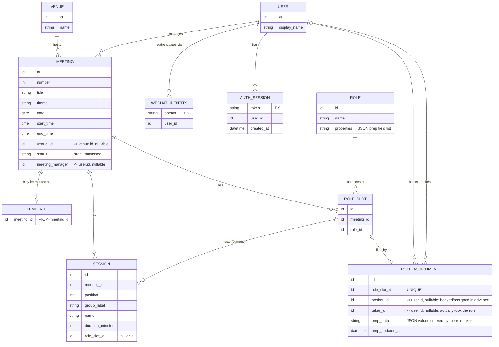

# Storage schema

We use sqlite to save the data.

Normalized tables are the source of truth; a meeting can still be served as one nested
JSON document via a view when needed.

Scope: covers the designed pages — meeting info & sessions (`meeting_info.md`) and role
booking (`role_registration.md`) — plus the shared user model and the auth tables
(identity + session) backing `../auth.md`. Voting, timer and poster storage are deferred
until those pages are designed.

## Entity overview



## `user`

A person the system knows about. Deliberately thin; admin credentials and WeChat
identity attach to a user through separate tables (`wechat_identity`, and a future
credential table) rather than columns here.

| Column         | Type    | Notes            |
| -------------- | ------- | ---------------- |
| `id`           | id (PK) |                  |
| `display_name` | string  | name or nickname |

Membership (member vs. guest) is intentionally omitted for now — it is a time-sensitive
relationship. See `todo.md`.

## `wechat_identity`

Maps a WeChat `openid` to a `user`. Auth is **pluggable** (see `../auth.md`): a user may
authenticate through several providers, so provider-specific identifiers live in their own
tables and keep `user` thin. A web user/password provider would add its own credential
table the same way.

| Column    | Type    | Notes                              |
| --------- | ------- | ---------------------------------- |
| `openid`  | string (PK) | WeChat openid for this mini program |
| `user_id` | id (FK)     | -> `user.id`                       |

- On first login the auth layer creates a thin `user` plus this mapping row.
- The only thing handed to the rest of the app is `user.id`; downstream code never sees
  `openid`.
- A future WeChat `session_key` (for decrypting phone/userinfo) would attach here if
  needed.

## `auth_session`

Server-side session store. Login mints an opaque token; requests carry it as
`Authorization: Bearer <token>` and the auth guard resolves it back to a `user.id`.

| Column       | Type     | Notes                          |
| ------------ | -------- | ------------------------------ |
| `token`      | string (PK) | random opaque session token |
| `user_id`    | id (FK)     | -> `user.id`                |
| `created_at` | datetime    | audit / future expiry       |

- Tokens are opaque and stored here, so sessions can be revoked by deleting rows.
- Expiry / cleanup is not enforced yet (first stage); `created_at` is recorded for when
  it is added.

## `venue`

The managed list of meeting locations. A meeting points to a venue row instead of storing
free text directly, so admins can build a reusable venue list over time.

| Column | Type    | Notes       |
| ------ | ------- | ----------- |
| `id`   | id (PK) |             |
| `name` | string  | **UNIQUE**  |

## `meeting`

The core entity. Sessions, role slots, assignments, agenda, timer, voting and check-in all hang off it.

| Column            | Type    | Notes                                                           |
| ----------------- | ------- | --------------------------------------------------------------- |
| `id`              | id (PK) |                                                                 |
| `number`          | int     | meeting number (derived from last + 1)                          |
| `title`           | string  |                                                                 |
| `theme`           | string  |                                                                 |
| `date`            | date    |                                                                 |
| `start_time`      | time    | meeting start; session start times derive from it               |
| `end_time`        | time    |                                                                 |
| `venue_id`        | id (FK) | -> `venue.id`; **nullable**                                     |
| `status`          | string  | `draft` \| `published`                                          |
| `meeting_manager` | id (FK) | -> `user.id`; **nullable** (templates / fresh drafts have none) |

Notes:
- **Inter-session buffer** is a constant (`BUFFER_MINUTES = 1`), not a column — nothing
  edits it in the current design. It is added after each session when computing the next
  session's start time.
- **Session start times** are computed (`start_time` + cumulative durations + buffer),
  never stored.

## `template`

Marker table for reusable meeting templates. A row means the referenced meeting can be
offered as a template; absence means it is a regular meeting.

| Column       | Type    | Notes                                      |
| ------------ | ------- | ------------------------------------------ |
| `meeting_id` | id (PK) | -> `meeting.id`; cascades when deleted     |

## `session`

An ordered row in a meeting's agenda: what happens, for how long, and which role
hosts it.

| Column             | Type    | Notes                            |
| ------------------ | ------- | -------------------------------- |
| `id`               | id (PK) |                                  |
| `meeting_id`       | id (FK) | -> `meeting.id`                  |
| `position`         | int     | order within the meeting         |
| `group_label`      | string  | visual grouping for the printed agenda |
| `name`             | string  | session name                     |
| `duration_minutes` | int     |                                  |
| `role_slot_id`     | id (FK) | -> `role_slot.id`; **nullable**  |

A session references at most one role slot (one role per session for now). Many sessions
may point to the **same** slot, so one slot can host multiple sessions (e.g. the
Toastmaster hosting several sessions). The slot is a user-agnostic structural row; who
booked or took it lives in `role_assignment`.

## `role`

The managed catalog of role **types** (distinct from a per-meeting slot). Grown via the
creatable combobox in the editor's Roles card. A repeated role (e.g. `Prepared Speaker`)
is a **single** catalog entry; the meeting gets one `role_slot` row per concrete opening.

| Column       | Type    | Notes                                                             |
| ------------ | ------- | ----------------------------------------------------------------- |
| `id`         | id (PK) |                                                                   |
| `name`       | string  |                                                                   |
| `properties` | string  | JSON ordered list of prep fields expected from this role taker; empty/NULL means no prep fields |

`properties` deliberately stays small: it describes only what data this role expects from
its taker. The submitted values live on `role_assignment.prep_data`.

Format:

```json
[
  { "key": "title", "type": "string" },
  { "key": "level", "type": "integer" }
]
```

Supported first-stage field types: `string` and `integer`. Field order is render order.
Field keys are stable snake_case names and become keys in `role_assignment.prep_data`.

First-stage example:

```json
// Prepared Speaker
[
  { "key": "title", "type": "string" },
  { "key": "pathway", "type": "string" },
  { "key": "level", "type": "integer" },
  { "key": "purpose", "type": "string" },
  { "key": "description", "type": "string" }
]
```

## `role_slot`

A concrete role opening in a specific meeting — one row per bookable seat. `Prepared
Speaker × 3` is three `role_slot` rows sharing the same `role_id`. **User-agnostic**: it
carries no booker/taker, so the whole meeting structure (`meeting`, `session`, `role_slot`)
can be edited, cloned into templates and published without touching any user data.

| Column       | Type    | Notes             |
| ------------ | ------- | ----------------- |
| `id`         | id (PK) |                   |
| `meeting_id` | id (FK) | -> `meeting.id`   |
| `role_id`    | id (FK) | -> `role.id`      |

- **Session-linked slot**: one or more sessions have `role_slot_id` pointing to it.
- **Meeting-wide slot**: no session references it (Timer, Ah-Counter, Grammarian,
  General Evaluator); it still exists so it can be booked.
- **Display ordinal**: the `1`/`2`/`3` in `Speaker 1`, `Speaker 2` is **not stored** — it
  is derived at render time as the slot's ordinal within its `role_id` group, so deleting a
  slot just re-numbers the rest.

## `role_assignment`

Who fills a `role_slot` — the **only** meeting-related table that references a user, so the
structural tables above stay user-agnostic. Zero or one assignment per slot. `booker_id` is
who booked or was assigned in advance; `taker_id` is who actually took it (populated by the
next-stage check-in flow).

| Column         | Type    | Notes                                                        |
| -------------- | ------- | ------------------------------------------------------------ |
| `id`           | id (PK) |                                                              |
| `role_slot_id` | id (FK) | -> `role_slot.id`; **UNIQUE** (one assignment per slot)      |
| `booker_id`    | id (FK) | -> `user.id`; **nullable** (null = not booked); set by role booking / admin assignment |
| `taker_id`     | id (FK) | -> `user.id`; **nullable** (null = not yet taken); set by check-in |
| `prep_data`    | string  | JSON object containing values entered by the role taker; defaults to `{}` |
| `prep_updated_at` | datetime | nullable timestamp for the last prep-data update          |

- **Which one downstream reads**: first-stage artifacts (agenda, printed pager, role
  booking cards) use `booker_id`; check-in and post-meeting artifacts prefer `taker_id`
  and fall back to `booker_id`.
- **Open slot**: no `role_assignment` row, or a row with `booker_id` NULL.
- **Prep data**: interpreted according to the assigned role's `role.properties` field
  list. Example for a prepared speaker:

```json
{
  "title": "The Unscripted Project",
  "pathway": "Engaging Humor",
  "level": 2,
  "purpose": "Practice using humor in a prepared speech.",
  "description": "5-7 minute prepared speech"
}
```

- **Assignment changes**: when a slot's `booker_id` changes to another user or is cleared,
  clear `prep_data` back to `{}`. If check-in later records a different `taker_id`, admin
  review can decide whether to keep or clear the prepared values.
- **Next stage**: check-in fills `taker_id` (and attendance for no-role attendees) to
  handle no-shows, substitutions and walk-ins.

## Meeting information ownership

Meeting-facing values such as `theme` and `keyword` are direct `meeting` columns. Role
takers prepare them by deep-linking into the Information tab:

- Grammarian → Information `keyword`.
- Table Topics Master → Information `theme`.

This keeps the club workflow simple: everyone edits the meeting page, and role ownership is
guided by links rather than enforced by separate storage.

## Serving a meeting as JSON (optional)

The normalized tables can be merged into one nested JSON document per meeting via a
SQLite view using `json_object` / `json_group_array` (JSON1, built in). Useful for
serving a whole meeting to the frontend or the WeChat mini program, and as the basis for
a future published-snapshot cache. Writes still go to the base tables. Left out for now;
added if/when needed.
